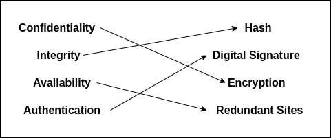

## CCT College

|                        |                                                                               |
|------------------------|-------------------------------------------------------------------------------|
| **Module Title:**      | Cryptography Theory and Practice                                              |
| **Assessment Title:**  | Applying Cybersecurity Principles and Mechanisms to Address Security Concerns |
| **Lecturer Name:**     | Dr. Naila Aslam                                                               |
| **Student Full Name:** | Javier Alfonso Ocampo                                                         |
| **Student Number:**    | 2024328                                                                       |

### Part 1

#### Task 1: Core principles of Cybersecurity

- **Confidentiality**: Ensures that sensitive information is kept private and only accessible by those who are authorized. This principle aims to prevent unauthorized access or data leaks. Common approaches include encrypting data, enforcing strict access controls, and using data obfuscation techniques.

- **Integrity**: Focuses on maintaining the accuracy and reliability of data throughout its lifecycle. The goal is to prevent unauthorized changes or tampering. Methods like checksums, digital signatures, and hashing algorithms help detect and prevent unintended modifications.

- **Availability**: Guarantees that systems and information are accessible when needed by authorized users. Downtime or service disruptions are minimized through strategies like system redundancy, load balancing, and regular system updates or backups.

- **Authentication**: Involves verifying the identity of users or systems before granting them access. It ensures that only legitimate entities can access resources. Common practices include using passwords, biometric verification, security tokens, and multi-factor authentication (MFA) for stronger security.

#### Task 2

:

{ width=50% }

### Part 2

#### Scenario 1

According to the description if an email was read by an unauthorized person we can say that confidentiality principle
was compromised. To avoid email leaks,we propose the use of unique passwords with two-factor authentication, and encrypt sensitive emails. Be cautious of phishing attempts and avoid sharing personal information via email. Keep your email software updated, limit access to critical accounts, and avoid using public Wi-Fi without a VPN.

### Scenario 2

Two principles were compromised. Integrity due to some financial records were modified. And authentication, even if the issue
was detected the lack of a good mechanism of authentication, indetifing the proper user is not possible.
To mitigate the issues, the company should implement multi-factor authentication to ensure proper user identity and apply role-based access control to limit access to sensitive data. Enforcing data integrity with cryptographic methods like digital signatures and hashing, also logging all user actions might help track modifications.
