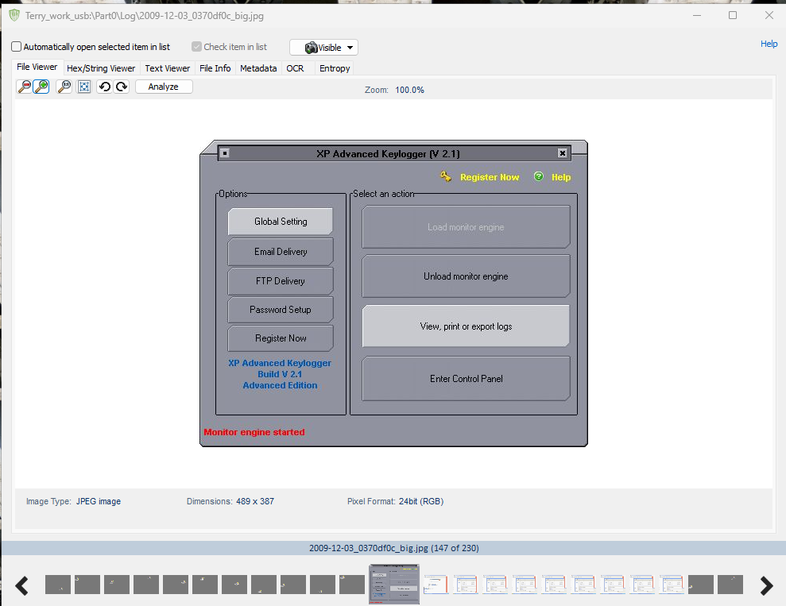
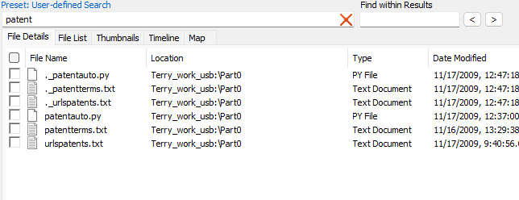
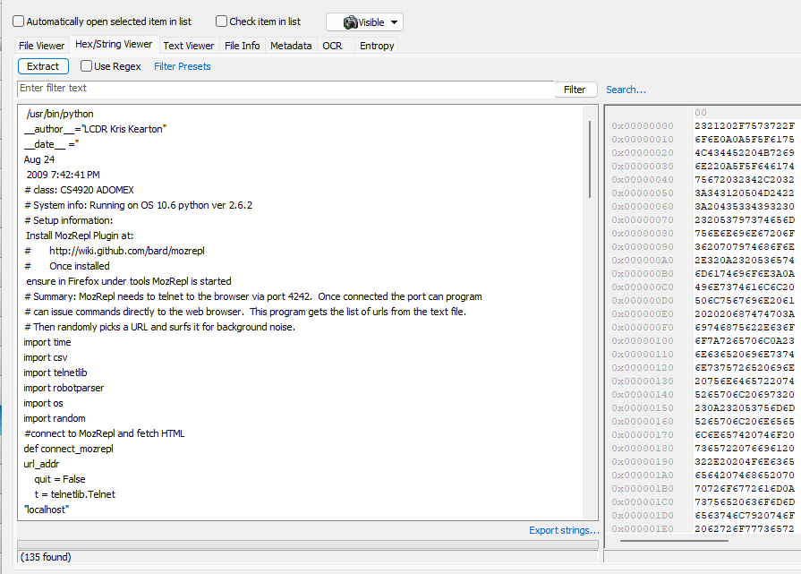

## CCT College

|                        |                                                       |
|------------------------|-------------------------------------------------------|
| **Module Title:**      | Master of Science in Cybersecurity                    |
| **Assessment Title:**  | Analysing Your Digital Evidence-Investigation Reports |
| **Lecturer Name:**     | Dr. Kashif Naseer Qureshi                             |
| **Student Full Name:** | Javier Alfonso Ocampo                                 |
| **Student Number:**    | 2024328                                               |

### Task 1

Forensic Analysis of USB Drive and Potential Impact on Patent Case

The contents of the USB drive suggest possible data collection and surveillance activities that could impact a patent case. Here’s a breakdown of the findings:

1. **Keylogging Software**
   - The first screenshot shows **XP Advanced Keylogger** software, which records keystrokes on a device. This tool could capture confidential data, including passwords or sensitive information related to patents.
   - **Impact on Patent Case**: If the keylogger was used to spy on communications or gather proprietary information, it could indicate an unethical or even illegal effort to obtain data. Such actions could affect the credibility of the party involved and may suggest **misappropriation of trade secrets** or **data theft**.

{ width=50% }

2. **Patent-Related Python Scripts**
   - The second screenshot displays several files with names like `patentauto.py` and `patentterms.txt`, suggesting Python scripts aimed at patent-related data. These scripts could be used to automate research, gather terms, or extract information from patent databases.
   - **Impact on Patent Case**: If these scripts were used to obtain data from patent resources without authorization, it may point to **unauthorized data collection**. This could give one party an unfair advantage and raise legal concerns about the methods used in gathering this information.

{ width=50% }

3. **Automated Web Browsing for Data Extraction (MozRepl Plugin)**
   - The third screenshot shows a Python script designed to use **MozRepl**, a tool for controlling a web browser, allowing for automated browsing and data extraction. The script includes libraries for network and data scraping, indicating it was set up to collect information from web pages.
   - **Impact on Patent Case**: This automated setup could have been used to scrape competitor or patent-related information from the internet. If used without proper consent, it could raise ethical and legal issues, as it implies a **deliberate attempt to gather potentially proprietary data**.

{ width=50% }

To sum up, the files on this USB drive suggest efforts to monitor, collect, and possibly misuse data. In a patent case, this evidence could lead to concerns about **data misappropriation**, **trade secret violations**, or **unethical competitive practices**.
If confidential or proprietary information was obtained through these methods, it could weaken the legal standing of the party involved.

### Task 2

In digital forensics, retrieving, analyzing, and preserving data from Android devices begins with **Pre-Data Extraction Techniques**. These preliminary steps secure
data integrity and involve isolating the device from networks, identifying the device model and Android version, and assessing security settings like encryption.
Following pre-extraction, **data retrieval** uses specialized tools to access stored files, messages, and app data. During **analysis**, investigators interpret this
data to uncover relevant evidence. Finally, **data preservation** ensures the original data remains intact using methods like imaging and hash value verification.
This structured process is crucial for maintaining the reliability of digital evidence.

In Android forensic investigations, specialized tools are essential for extracting a variety of data types from devices. Tools like **Cellebrite UFED** are widely used due to their ability to perform physical, logical, and file system extractions. With Cellebrite, forensic analysts can retrieve fundamental data, such as call logs, SMS messages, contact lists, and media files stored on the device.

For open-source alternatives, **ADB (Android Debug Bridge)** is a versatile tool that enables data extraction without specialized software. Although less comprehensive than proprietary solutions, ADB can access files, retrieve logs, and copy various types of data from an Android device. Investigators can use ADB to examine file systems, capture screenshots, and pull key data, making it a valuable tool in cases where access to proprietary software is limited.

For extracting data from both the device and associated cloud services, **Oxygen Forensic Detective** is highly valuable. It enables investigators to gather information from various sources, including chats, multimedia files, GPS data, and other app-related content. This capability is crucial when investigating user interactions on platforms like WhatsApp and Facebook.

**Autopsy** serves as an effective analysis tool for data once extracted, especially for identifying digital artifacts like browser history, downloaded files, and traces left by different apps. By examining these artifacts, investigators can gain insights into the user's online activities and interaction patterns.

Together, these tools enable forensic investigators to gather a comprehensive dataset from Android devices, including user data (contacts, messages, and call logs), app data (social media activity and chats), location information, and web browsing history. With advanced tools, investigators can also recover deleted data, which often provides critical information in cases involving Android devices.

Dealing with encrypted Android devices presents significant challenges for forensic investigators, primarily due to the complexity of breaking through encryption to access data. Modern Android devices often utilize full-disk encryption, meaning all stored data is encoded in a way that can only be unlocked using a user-specific PIN, password, or biometric authentication. This encryption protects user data from unauthorized access, but it also makes forensic extraction difficult without the user credentials. 

One of the main challenges in handling encrypted devices is bypassing or breaking encryption without compromising the device’s data integrity. Attempts to circumvent encryption can lead to data corruption, or in worst cases, the device may lock or even delete its contents after repeated unsuccessful access attempts.

To preserve data integrity, forensic investigators employ several methods:

1. **Physical Isolation:** Disconnecting the device from networks and preventing updates or changes that could affect data is crucial. This may involve putting the device in "airplane mode" or using a Faraday bag to block signals, ensuring the device’s state remains unchanged.

2. **Creating a Bit-for-Bit Copy:** Before attempting any decryption or data access, investigators create a forensic image of the device — an exact bit-for-bit copy of all data on the device. This practice preserves the original data in its initial state, allowing analysis to be conducted on the duplicate, thus protecting the source data from alteration.

3. **Using Specialized Forensic Tools:** Certain tools like Cellebrite UFED or Oxygen Forensic Detective offer limited methods to access some parts of encrypted data through specialized extraction techniques. However, they can also assist in creating secure, authenticated images of the data for further examination.

4. **Key Extraction Techniques:** In cases where the encryption key can be obtained (e.g., with user consent or specific legal orders), forensic tools may use methods like memory acquisition to extract the decryption key while the device is powered on. This can sometimes bypass or reduce encryption barriers, allowing access to the data without altering it.

5. **Maintaining Chain of Custody Documentation:** Throughout the process, investigators document each step in detail, noting timestamps, actions taken, and tools used. This documentation ensures data integrity and supports the validity of findings in legal proceedings.

Forensic investigators use a variety of techniques to recover deleted data from Android devices, often relying on specialized tools that can retrieve remnants of deleted files from device storage. When files are "deleted" from a device, they are typically not immediately erased but rather marked as available space. Until overwritten by new data, these "deleted" files can still be accessed using forensic tools capable of scanning storage sectors and recovering fragmented file data.

Some techniques are:

1. **File Carving:** Forensic software uses file carving to locate file fragments within unallocated storage space by identifying file headers, footers, and structures. Tools like Autopsy and Cellebrite UFED scan storage at a low level to reassemble parts of deleted files that may no longer have a file system reference but still exist in memory.

2. **Database Analysis:** Many apps, including WhatsApp and Facebook, store data in SQLite databases. When records within these databases are deleted, the data is often retained until the database space is repurposed. Forensic tools can analyze these databases, accessing deleted messages, media, and user activity that has not yet been overwritten.

3. **Cloud Synchronization and Backups:** Social media and messaging apps often back up user data to cloud services. Even if data is deleted from a device, it may still exist in cloud backups. Investigators can access cloud-stored versions of data, such as messages and multimedia, by using tools like Oxygen Forensic Detective, provided they have proper authorization.

The version of Android on a device directly affects the forensic process because each update brings new security features that can make data extraction more difficult. For example, since Android 6.0, encryption has been standard, meaning all device data is encoded and requires a password to access. Android 10 and later versions added hardware-backed encryption, storing decryption keys securely within the device hardware, which makes bypassing security without user credentials even more challenging.

When a device is locked, forensic investigators use several strategies to access data without compromising its integrity. Older Android versions sometimes have software vulnerabilities that can allow investigators to bypass the lock screen or access certain files, although these vulnerabilities are often fixed in newer updates. On devices with weak or short PINs, brute-force attempts to guess the code might succeed, though modern versions quickly lock or wipe the device if too many incorrect guesses are made.

If direct access to the device fails, investigators may turn to advanced techniques like chip-off or JTAG extraction. These methods involve physically accessing the device’s memory or data ports, allowing analysts to read stored data without going through the Android operating system, though they’re complex and risky. Additionally, if investigators can legally access a user’s credentials or biometric data, they can unlock the device using forensic tools that simulate a normal user login.

When none of these options work, cloud backups offer an alternative way to obtain valuable data. Many Android devices sync data to a user’s Google account, which may store contacts, messages, app data, and media in the cloud. With proper authorization, investigators can access this account information, providing crucial insights even if the device remains locked.

Overall, Android’s security features make forensic access more complex as the operating system evolves, but investigators adapt by using both traditional methods and cloud resources to gather as much data as possible.
