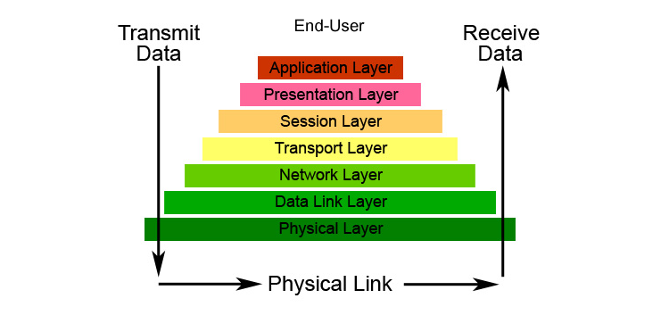

## CCT Dublin College

|                        |                                                       |
|------------------------|-------------------------------------------------------|
| **Module Title:**      | Forensic Principles & Analysis                        |
| **Assessment Title:**  | Analysing Your Digital Evidence-Investigation Reports |
| **Lecturer Name:**     | Dr. Kashif Naseer Qureshi                             |
| **Student Full Name:** | Javier Alfonso Ocampo                                 |
| **Student Number:**    | 2024328                                               |

### Assignment 1

#### Task 1: Enhancing Evidence Analysis

**Introduction**

Modern digital forensic investigations have become increasingly complex as they often involve analysing massive volumes of data collected from diverse sources. This data includes emails, images, documents, logs, and other digital artifacts extracted from multiple devices, such as computers, smartphones, and servers. Such investigations are further complicated by the need to handle structured, semi-structured, and unstructured data, often under tight deadlines. As the size and complexity of these datasets grow, traditional manual analysis methods struggle to keep up, leading to delays, oversight, and inaccuracies.

To address these challenges, Artificial Intelligence (AI) and Machine Learning (ML) have emerged as transformative tools in the field of digital forensics. These technologies provide forensic experts with the ability to automate labor-intensive processes, intelligently categorise information, and identify patterns that might otherwise go unnoticed. AI and ML enable faster extraction of critical insights while minimising the risk of human error, allowing investigators to focus on interpreting results and making informed decisions. Their ability to process vast datasets in real time not only enhances the efficiency of forensic investigations but also ensures that critical evidence is identified and preserved more effectively.

**Role of AI and Machine Learning**

- Automated Categorisation: Machine Learning (ML) algorithms, such as clustering and classification techniques, can efficiently group similar items within large datasets. For example, clustering methods like K-Means can organise emails by sender, topic, or communication frequency, drastically reducing the time investigators spend manually sorting and grouping evidence. This enables faster identification of relevant data subsets.

- Natural Language Processing (NLP): NLP tools can analyse written documents and emails to extract key topics, sentiments, and even hidden meanings. Advanced models like [spaCy](https://spacy.io/) or [BERT](https://h2o.ai/wiki/bert/#:~:text=BERT%2C%20short%20for%20Bidirectional%20Encoder,framework%20for%20natural%20language%20processing.) can indentify critical conversations, phrases, or patterns, helping investigators quickly focus on significant portions of textual data that may be relevant to the case. This is particularly useful for uncovering subtle connections or detecting coded language.

- Computer Vision: AI-powered image recognition tools enable forensic investigators to analyse photos and videos with precision. Tools like [TensorFlow](https://www.tensorflow.org/) or [Amazon Rekognition](https://aws.amazon.com/rekognition/) can identify objects, faces, or even embedded text within images. These capabilities can be used to locate specific individuals, identify incriminating visuals, or extract evidence hidden within multimedia content.

- Pattern Recognition: Machine learning excels at detecting anomalies and unusual patterns across large datasets. Algorithms like random forests or decision trees can reveal trends, correlations, or deviations that indicate malicious activity, such as fraud or unauthorised access. This makes pattern recognition an invaluable tool in identifying subtle indicators of wrongdoing that might otherwise go unnoticed.

**Tools for Evidence Analysis**

- TensorFlow/PyTorch: These are powerful, open-source frameworks widely used for developing and training custom AI models. In forensic investigations, they can be leveraged to build tailored solutions for specific needs, such as detecting anomalies in datasets, recognising objects in images, or performing natural language analysis on large volumes of text. Their flexibility allows forensic teams to address unique challenges that pre-trained tools may not cover.

- Microsoft Azure Cognitive Services: This suite of pre-trained AI models provides an accessible solution for analysing unstructured data like emails, documents, or images. Azure's services include text sentiment analysis, keyword extraction, image recognition, and even translation, making it a valuable tool for rapidly processing diverse datasets without the need for developing models from scratch.

- Forensic-Specific Tools: Purpose-built software like Magnet AXIOM integrates AI seamlessly into forensic workflows. These tools are designed to automate evidence analysis tasks, such as extracting critical information from device images, parsing email data, or identifying patterns in user activity. By combining traditional forensic techniques with AI-driven automation, tools like AXIOM save time and enhance the accuracy of investigations.

**Challenges and Limitations**

Data Quality and Bias: The effectiveness of AI models heavily depends on the quality of the training data. If the data is incomplete, poorly labelled, or biased, the models may generate inaccurate results. This could lead to critical evidence being misclassified or entirely overlooked, jeopardising the integrity of the investigation.

False Positives: AI systems are not immune to errors and may flag irrelevant or benign items as critical evidence. These false positives can overwhelm investigators with unnecessary data, increasing their workload and potentially diverting attention from genuinely important findings.

Legal and Ethical Issues: The use of AI in forensic investigations often involves processing sensitive personal data, raising significant legal and ethical concerns. Regulations like GDPR strictly govern the collection, analysis, and storage of personal data, and failing to adhere to these laws could result in legal repercussions and challenges to the admissibility of evidence.

Interpretability: Many machine learning models, especially complex ones like deep learning algorithms, function as black boxes. Their decisions lack transparency, making it difficult for forensic experts to explain how specific evidence was identified or classified. This lack of interpretability can be problematic in a courtroom setting, where clear and defensible explanations are required to validate findings.

**Conclusion**

AI and ML offer transformative potential in forensic investigations, especially when analysing large datasets. By leveraging these technologies, investigators can work more efficiently and make more accurate decisions. However, integrating these tools requires careful planning, addressing their limitations and legal implications to ensure their effectiveness.

#### Task 2: Identifying Patterns in Cybercrime

**Overview**

Cyberattacks on financial institutions remain a critical threat due to the sensitive nature of their data. Cybercriminals often hide their actions as routine network traffic, exploiting the limitations of traditional detection systems. Machine learning (ML) might help to discover some patterns of attacks. Particularly anomaly detection techniques, provides a cutting-edge solution to uncover these concealed breaches, offering financial institutions a better chance to safeguard their assets and data.

Anomaly detection focuses on identifying data points that deviate significantly from established patterns. By analysing historical network traffic, ML models can learn normal behaviour and detect deviations that could indicate potential cyber threats.

**Models and Techniques:**

- Statistical Models: Basic anomaly detection uses thresholds (e.g., standard deviations from the mean) to flag deviations in traffic behaviour. Though simple, they can struggle with complex datasets or evolving attack vectors.

- Machine Learning Models:
  - Autoencoders: Neural networks trained to compress and reconstruct data. Large reconstruction errors often indicate anomalies.
  - Clustering Algorithms: Techniques like DBSCAN (Density-Based Spatial Clustering of Applications with Noise) can group similar behaviours and isolate outliers in network traffic.

- Hybrid Approaches: Combining ML models with statistical methods creates more robust systems, improving the accuracy of anomaly detection by leveraging the strengths of both.

**Tools for Implementation:**

- [Splunk](https://www.splunk.com/): is a powerful platform for real-time monitoring, searching, and analysing large volumes of log and network data. It integrates machine learning-based anomaly detection to identify deviations from normal behaviour, offering visualisations, automated alerts, and real-time dashboards. Its Machine Learning Toolkit allows for custom model training, making it highly effective for uncovering hidden threats in complex datasets.

- [Elastic Security](https://www.elastic.co/security): provides advanced anomaly detection by analysing logs and network traffic to flag suspicious activity. Its machine learning features, like outlier detection, help identify unusual patterns, while detailed, customisable dashboards offer actionable insights. Its open architecture supports integration with external threat intelligence, enhancing its detection capabilities.

**Challenges in Detecting Malicious Patterns**

- Encryption: The growing use of encryption protocols (e.g., HTTPS, TLS) reduces visibility into network data, making it difficult to analyse payload content. While anomaly detection focuses on metadata like packet size or timing, it may miss context-critical insights hidden in the encrypted payloads.

- False Positives: High numbers of flagged anomalies can overwhelm investigators, especially since many deviations are benign (e.g., unusual but legitimate user activity). This can lead to alert fatigue, where genuine threats are overlooked due to excessive noise.

- Sophistication of Attackers: Threat actors employ advanced techniques such as polymorphic malware (which changes signatures) or blending malicious traffic into legitimate channels (e.g., mimicking DNS queries). These tactics make it challenging to differentiate between routine behaviour and true threats.

**Conclusion**

Machine learning, particularly anomaly detection, offers a promising approach to uncovering hidden breaches in network traffic. It enables organisations to proactively detect deviations from normal behaviour and connect them to potential threats. While challenges such as encryption, false positives, and evolving attack techniques persist, integrating ML with robust tools and human expertise significantly improves both threat detection and attribution. By leveraging these methods, financial institutions can stay ahead of attackers, ensuring greater security and resilience against cybercrime.

### Assignment 2

#### Task 1: Integrating OSI Model Layers in Network Forensic Analysis

**Overview**

The Open Systems Interconnection (OSI) model is a conceptual framework that divides network communications functions into seven layers. Sending data over a network is complex because various hardware and software technologies must work cohesively across geographical and political boundaries. The OSI data model provides a universal language for computer networking, so diverse technologies can communicate using standard protocols or rules of communication. Every technology in a specific layer must provide certain capabilities and perform specific functions to be useful in networking. Technologies in the higher layers benefit from abstraction as they can use lower-level technologies without having to worry about underlying implementation details.

{ width=50% }

Network forensic analysis is a critical component of identifying and mitigating cyberattacks, especially in complex environments where threats can occur across multiple layers of communication. The OSI model provides a structured framework for analysing network activity, with each layer offering unique types of evidence. By systematically investigating each layer, forensic experts can uncover crucial details ranging from hardware anomalies to high-level application logs, enabling them to trace malicious actions back to their sources.

**Key Artifacts by Layer**

- Physical Layer (Layer 1): This layer deals with the physical aspects of communication, such as cables, hardware, and wireless signals. Evidence here may include instances of cable tampering, abnormal signal interference, or port activity logs, which might indicate physical access by an attacker.

- Data Link Layer (Layer 2): Investigators at this layer focus on identifying devices and their connections. MAC addresses and VLAN (Virtual LAN) data are essential artifacts, helping detect unauthorised devices or improper VLAN configurations used by attackers to bypass network restrictions.

- Network Layer (Layer 3): This layer offers insights into IP addressing, routing information, and packet headers. Anomalies in IP addresses or routes can reveal the origin and destination of malicious traffic, aiding in identifying compromised devices or external threat actors.

- Transport Layer (Layer 4): At the transport layer, evidence includes port activity and protocol-specific information, such as TCP and UDP connections. Investigators can identify suspicious sessions, such as unusual traffic spikes on uncommon ports or unexpected patterns in communication protocols.

- Application Layer (Layer 7): This layer focuses on user-level interactions with services like HTTP, FTP, and DNS. Logs from applications can reveal the content of attacks, such as SQL injection attempts, malicious file uploads, or suspicious DNS queries used for exfiltration or command-and-control communication.

Layers 5 (Session) and 6 (Presentation) of the OSI model are often overlooked in practice because their functionality is either less distinct in modern protocols or overlaps significantly with other layers, especially Layers 4 (Transport) and 7 (Application).

**Challenges in Network Forensics**

- Encryption: Encrypted traffic (e.g., HTTPS, TLS) significantly limits visibility into payloads, making it harder to analyse malicious content. Investigators must rely on metadata, lawful interception, or strategies like SSL termination (where permissible).

- High Volume of Data: Large networks produce immense quantities of logs and packet captures, which can overwhelm forensic teams and tools. Processing this data requires scalable systems, often leveraging AI to streamline and prioritise analysis.

- Obfuscation Tactics: Attackers frequently use advanced techniques such as protocol tunnelling, fragmentation, or data encoding to evade detection. These tactics require sophisticated forensic tools capable of reconstructing and interpreting fragmented or hidden communications.

**Conclusion**

Effectively leveraging the OSI model allows investigators to systematically analyse network activities across all layers, ensuring no artifact is overlooked. While challenges like encryption, data volume, and obfuscation persist, the combination of OSI-based methodologies with advanced forensic tools enables a more accurate and timely response to network-based threats. By integrating this approach into their workflows, forensic teams can enhance their ability to detect, attribute, and mitigate malicious activities, ultimately bolstering an organisation's security posture.

### Task 2: Report Writing for High-Tech Investigations

High-tech forensic investigations often result in comprehensive reports that are essential for legal proceedings and organisational decision-making. These reports must balance technical accuracy with accessibility, ensuring that the findings are understandable to a diverse audience, including technical experts, legal professionals, and non-technical stakeholders such as juries or executives. Achieving this balance is critical to ensure the report's credibility and effectiveness in supporting justice and informed decision-making.

A strong forensic report typically begins with an executive summary, which provides a concise overview of the investigation and its key findings. This allows readers to quickly grasp the significance of the investigation without delving into technical details. Another crucial component is the chain of custody, which documents the collection, transfer, and storage of evidence. This ensures that the evidence remains authentic and legally admissible. The detailed analysis section, on the other hand, provides a clear explanation of investigative methods and findings in a logical, step-by-step format, enhancing transparency and reproducibility. Visual aids such as diagrams, charts, and timelines can also play an essential role, helping to simplify complex data and improve understanding for all audiences.

Writing forensic reports comes with its own set of challenges. One of the most significant is balancing technical precision with simplicity to ensure the report remains accessible to readers without technical expertise. At the same time, every step of the evidence handling and analysis must be meticulously documented to make the report legally defensible in court. Overuse of technical jargon is another issue that can confuse non-expert readers, potentially undermining the report's impact. Furthermore, maintaining objectivity is critical; all conclusions must be based solely on the evidence, presented without bias or assumptions, to ensure credibility.

In conclusion, forensic reports are a cornerstone of high-tech investigations, acting as both a detailed technical document and a persuasive communication tool. By focusing on clarity, accuracy, and objectivity, investigators can ensure that their findings are credible, actionable, and defensible, contributing to the pursuit of justice and the improvement of organisational practices.
