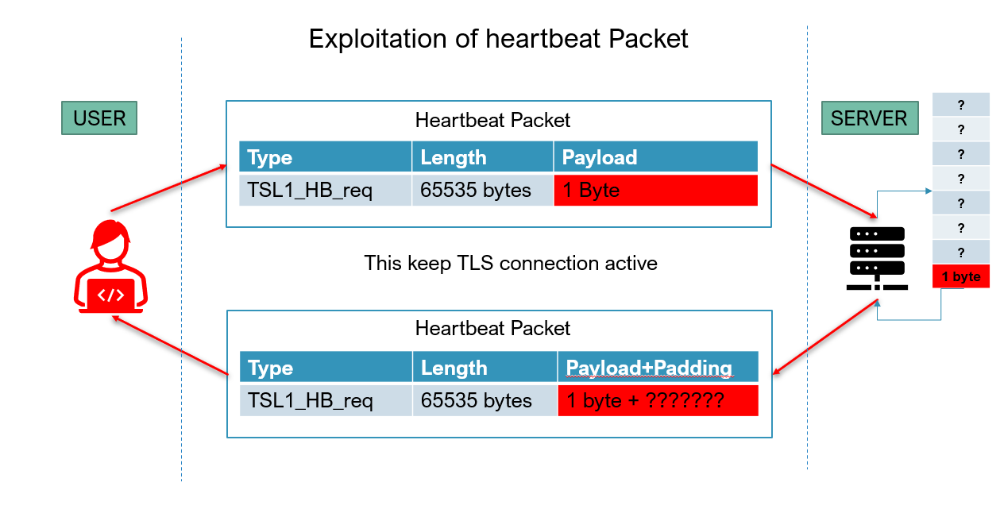

## CCT College Dublin


|                        |                                                                                      |
|------------------------|--------------------------------------------------------------------------------------|
| **Module Title:**      | Secure Programming and Scripting                                                     |
| **Assessment Title:**  | Research Report on Security Breach Incidents: Lessons in Secure Coding and Scripting |
| **Lecturer Name:**     | David Gonzalez                                                                       |
| **Student Full Name:** | Javier Alfonso Ocampo                                                                |
| **Student Number:**    | 2024328                                                                              |


### Incident: The Equifax data breach (2017) - vulnerability in Apache Struts.

Equifax Inc. is an American multinational consumer credit reporting agency. Equifax collects and aggregates information on over 800 million individual consumers and more than 88 million businesses worldwide. The Equifax data breach of 2017 exposed sensitive personal and financial information of over 145 million individuals, making it one of the most significant cybersecurity incidents in history. The breach was caused by a vulnerability
in the **Apache Struts** framework ([CVE-2017-5638](https://nvd.nist.gov/vuln/detail/cve-2017-5638)), which had been publicly disclosed and patched in March
2017. However, Equifax failed to apply the patch promptly, leaving their systems exposed for months. This vulnerability allowed attackers to exploit a flaw in
the framework’s file upload component, enabling **remote code execution (RCE)** and unauthorised access to Equifax's databases.

Apache Struts is a free, open-source, MVC framework for creating Java web applications. The Jakarta Multipart component is part of the Apache Struts framework, responsible for handling file uploads in web applications. It processes multipart HTTP requests, typically used when users upload files alongside form data. This component is designed to parse incoming request data, separate the uploaded files, and make them accessible to the application.

In the case of [CVE-2017-5638](https://nvd.nist.gov/vuln/detail/cve-2017-5638), the Jakarta Multipart Parser contained a critical flaw in how it processed HTTP request headers. Specifically, attackers could craft malicious `Content-Type` headers containing executable code. The parser failed to properly validate and sanitize these headers, allowing the execution of arbitrary commands on the server. This vulnerability highlights how insecure input handling in critical components can lead to major security incidents, such as the Equifax data breach.


Example of a malicious content-type header:

```
POST /example-struts-action HTTP/1.1
Host: target-website.com
Content-Type: %{(#_='multipart/form-data').(#dm=@ognl.OgnlContext@DEFAULT_MEMBER_ACCESS).(#_memberAccess?(#_memberAccess=#dm):(\
#context.setMemberAccess(#dm))).(#cmd='id').(#iswin=(@java.lang.System@getProperty('os.name').toLowerCase().contains('win'))).(\
#cmds=(#iswin?{'cmd.exe','/c',#cmd}:{'/bin/sh','-c',#cmd})).(#p=new java.lang.ProcessBuilder(#cmds)).(#p.redirectErrorStream(true)).(\
#process=#p.start()).(#ros=(@org.apache.struts2.ServletActionContext@getResponse().getOutputStream())).(@org.apache.commons.io.IOUtils@copy(\
#process.getInputStream(),#ros)).(#ros.flush())}
```

**Timeline**

- \textcolor{olive}{August 31, 2012:} Code containing bug which ultimately becomes CVE-2017-5638 is introduced in Apache Struts.
- \textcolor{olive}{November 19, 2012:} Apache Struts 2, officially realease version 2.3.7.
- \textcolor{olive}{May 21, 2015:} Work begins on Apache Struts 2.5 using version 2.3.7 as a base.
- \textcolor{olive}{May 9, 2016:} Apache Struts 2.5 is released. (Security bug existed in code for over 4 years)
- \textcolor{olive}{March 6, 2017:} Version 2.3.32 and 2.5.10.1 is released with fixes availables.
- \textcolor{orange}{March 7, 2017:} Apache Struts issue emergency security alert, reporting the bug as a vulnerability. ExploitDB publishes an exploit.
- \textcolor{orange}{March 10, 2017:} CVE-2017-5638 entered in National vulnerability database (NVD) with placeholder details.
- \textcolor{orange}{March 14, 2017:} Vulnerability details for CVE-2017-5638 added to NVD.
- \textcolor{red}{May 13, 2017:} Hackers access files containing personal information at Equinax.
- \textcolor{red}{July 29, 2017:} Equifax's Security team observes suspicious network traffic associated with its U.S. online dispute portal web application. They investigate and block suspicious traffic.
- \textcolor{red}{July 30, 2017:} Equinax takes affected web application offline after observing additional suspicious activity. They discover Apache Struts vulnerability CVE-2017-5638 is the initial vector, Equinax patches the affected web application.
- \textcolor{red}{August 2, 2017:} Equinax hires Mandiant to do a forensic review to determine scope of the intrusion.
- \textcolor{red}{September 7, 2017:} Equinax announces that hackers gained access to company data, potentially compromising sensitive information for 143 million people in US, UK and Canada, including Social Security numbers and driver's license numbers.

**Lesson lerned / Recommendations**

- Timely Patching is Crucial: Always prioritize and apply security patches promptly for known vulnerabilities.
- Validate user input It’s the root cause of many attacks (XSS, Command Injection, etc.)
- Configure your components properly Turn off every feature you’re not using to reduce the attack surface.
- Monitor vulnerabilities and update your 3rd party softwares regularly Train your DevOps and sysadmin team to prudently maintain third-party software or use automated solutions, like Snyk.


### Incident: Security flaw in the Arc browser (2024)

Arc is a web browser powered by The Browser Company, a startup company founded by Josh Miller and Hursh Agrawal. They position themselves as an alternative to Chrome. Arc aims to act as an "operating system for the web" and tries to integrate web browsing with built-in applications and features. These include a scrapbook-style "easel" and "boosts," a feature that lets users cosmetically redesign a website in a similar way to browser extensions. The sidebar contains all of the browser's functionality besides the browsing window. Arc is based on Chromium and is written in Swift. It supports Chrome browser extensions and uses Google Search by default.

The flaw [CVE-2024-45489](https://nvd.nist.gov/vuln/detail/CVE-2024-45489) allowed attackers to gain access to anyone's browser without them even visiting a website. Nevertheless, while no users were affected, this was a critical vulnerability due to the simplicity of the attack. This company has raised $50M at a $550M valuation; at this level of investment, such security issues are unusual.

The Arc browser used Firebase Authentication, but not only that, it also used Firestore, which is a database-as-a-backend service that allows developers to avoid writing a backend and instead write database security rules to allow users to directly access the database. It is well known that these rules are frequently misconfigured, which leads to security issues.

With a hacky script to print all the calls to Firebase performed by the user, xyz3va launched Arc with the script loaded on startup, and this is what he got:


```javascript
firebase.doc("preferences/UvMIUnuxJ2h0E47fmZPpHLisHn12");
firebase.doc(
  "preferences/UvMIUnuxJ2h0E47fmZPpHLisHn12/stringValues/autoArchiveTimeThreshold"
);
firebase.doc("preferences/UvMIUnuxJ2h0E47fmZPpHLisHn12");
firebase.doc(
  "preferences/UvMIUnuxJ2h0E47fmZPpHLisHn12/stringValues/autoArchiveLittleArcTimeThreshold"
);
firebase.doc("preferences/UvMIUnuxJ2h0E47fmZPpHLisHn12");
firebase.doc(
  "preferences/UvMIUnuxJ2h0E47fmZPpHLisHn12/stringValues/autoArchiveTimeThresholdsPerProfile"
);
firebase.doc("users/UvMIUnuxJ2h0E47fmZPpHLisHn12");
firebase
  .collection("user_referrals")
  .where("inviter_id", "==", "UvMIUnuxJ2h0E47fmZPpHLisHn12");
firebase
  .collection("boosts")
  .where("creatorID", "==", "UvMIUnuxJ2h0E47fmZPpHLisHn12");
```

Arc boosts are a way for users to customize websites, by blocking elements, changing fonts, colors, and even using their own custom css and js. So with that in mine. So with all this said, we can notice that the boost are retrieved by `creatorID`, it was not possible to query with others `creatorID's` but
it was possible to update the own boost with another users id.

To sum up:

- Arc boosts can contain arbitrary javascript
- Arc boosts are stored in firestore
- The arc browser gets which boosts to use via the creatorID field
- We can arbitrarily chage the creatorID field to any user id


Some preventions

- Enforce Strict Security Rules: Implement and regularly update Firestore security rules to control access based on user authentication and permissions. Validate every operation server-side to ensure unauthorized users cannot access or manipulate sensitive data.
- Disable Public Access: Avoid default public access settings in Firebase and Firestore. Ensure all data access is tied to verified user authentication, and restrict anonymous access unless absolutely necessary for specific use cases.
- Conduct Regular Configuration Audits: Regularly review and audit Firebase and Firestore configurations to detect and fix misconfigurations. Use tools like Firebase App Check and enable logging to monitor access patterns, ensuring only legitimate traffic interacts with your backend.


### Incident: The Heartbleed bug (2014) - OpenSSL coding flaw

The Heartbleed bug was a critical vulnerability in *OpenSSL*, discovered in 2014 and tracked as [CVE-2014-0160](https://nvd.nist.gov/vuln/detail/cve-2014-0160). It allowed attackers to exploit a flaw in the "heartbeat" extension, which is used to maintain SSL/TLS connections. This resulted in unauthorized memory leakage from the affected server.

While the total number of users affected is not precisely known due to the nature of the attack leaving no traces, notable incidents include the compromise of
approximately 900 Canadian taxpayers' social insurance numbers from the Canada Revenue Agency. Many high-profile websites were vulnerable, including major
platforms using Apache and nginx, which are reliant on OpenSSL.

The bug's impact was amplified by its simplicity and the widespread adoption of OpenSSL—at the time, used by over 66% of all websites employing HTTPS
Heartbleed exemplified the dangers of coding flaws in critical software and underscored the importance of rigorous code review and testing.

The issue is originated from an improper bounds checking in the "heartbeat" feature of OpenSSL. When a client sent a heartbeat request, it included a payload length. The vulnerable OpenSSL implementation trusted this length without verification, leading to memory leakage.

The specific coding issue was a failure to validate whether the payload size specified in the heartbeat message matched the actual size of the payload sent.

{ width=50% }

The code snippet below shows the flaw:

```c
memcpy(bp, pl, payload); // Copies payload bytes without ensuring 'payload' is valid.
```

If an attacker crafted a malicious heartbeat message with a larger payload length than actual data, the server would copy extra memory from its heap and send it back in the response. This memory could contain sensitive information like private keys or session data.

Affected Versions: `OpenSSL versions 1.0.1 to 1.0.1f`.

Response and Fix, OpenSSL released `version 1.0.1g`, which included proper bounds checking to ensure the payload size did not exceed the actual data sent.

**Mitigations steps:**

1. Update to a patched OpenSSL version.
2. Revoke and reissue SSL/TLS certificates.
3. Prompt users to reset passwords for services using vulnerable OpenSSL versions.

**Lessons Learned**

1. Secure Coding Practices:
   - Reinforced the need for strict input validation, especially for untrusted user inputs.
   - Highlighted the dangers of trusting client-supplied values.

2. Auditing Open Source:
   - Illustrated the need for thorough code review and regular audits of widely-used libraries.

3. Proactive Defense:
   - Highlighted the importance of defense-in-depth approaches, such as monitoring for anomalies in data requests and limiting sensitive data exposure.
